# Technical Report: AD Extraction Pipeline

## 1. Approach

I built this pipeline to be: **reliability at speed and cost efficience**.

Instead of throwing everything at an expensive AI model, I used a **hybrid approach**. So the pipeline will act like a smart triage nurse: standard cases get handled by fast, simple rules. But only the weird, complex cases get sent to the "specialist" (the AI Fallback).

```mermaid
flowchart TD
    A[" Upload AD PDF"] --> B["🔄 Docling Conversion"]
    B --> C["📝 Markdown Text"]
    C --> D{"🔍 Detect Authority"}
    D -->|FAA| E[" FAA Regex Extractor"]
    D -->|EASA| F[" EASA Regex Extractor"]
    D -->|other format| G[" LLM Fallback (OpenAI)"]
    E --> H{"✅ Rules Found?"}
    F --> H
    H -->|Yes| I["📊 Structured Output"]
    H -->|No| G
    G --> I
    I --> J["💾 Pydantic Models"]
    J --> K["🔍 Evaluation Engine"]
    K --> L["✅ Results + Reasoning"]
    
    style A fill:#e1f5ff
    style B fill:#fff3e0
    style G fill:#f3e5f5
    style I fill:#e8f5e9
    style L fill:#e8f5e9
```

### How It Works
1.  **Reading the PDF**: I used **Docling** to turn the PDF into clean Markdown text. I chose this over simple text extraction because Docling understands document structure (like headers and lists), which helps me find the exact "Applicability" section without guessing. And also i use this because it's library that i recently see in Threads.
2.  **Smart Routing**: The system reads the text and automatically figures out if it's an **FAA**, **EASA** or Other format of AD's document.
3.  **The Fast Lane (Regex)**: For 90% of ADs, the format is predictable.So i wrote specific patterns (Regex) to catch these. It's essentially free and finishes in milliseconds.
4.  **The Safety Net (AI Fallback)**: If the regex finds nothing (maybe the format changed, or it's a weird scanned doc), the system automatically sends the text to **GPT-4o-mini**. This ensures the pipeline never crashes just because a document looks different.

## 2. Challenges

### "And" vs "Or" Ambiguity
EASA AD 2025-0254 was tricky. It listed exclusions saying: "except those with mod A **and** except those with mod B".
To a computer, "and" usually means "both must be true". But in this context, it meant "if you have **either** one, you're safe". I had to write the logic to treat these as a list of independent "get out of jail free" cards.

### Matching Aircraft Variants
Aviation data is messy. An AD might apply to "A320", but the fleet has "A320-214".
I built a smart matcher that understands hierarchy:
- A generic rule for "A320" **applies** to a specific "A320-214".
- A specific rule for "A320-214" **does not** apply to a generic "A320".
This keeps the logic safe and conservative.

### Detecting Unseen Formats
Hard-coding regex patterns is hard to catchup with new format sometimes. If the FAA changes their font or layout next week, regex breaks.
That's why adding the **LLM Fallback** was the most critical challenge I solved. It turns a fragile script into a robust system that can handle the unexpected.

## 3. Limitations

### Complex Tables
Some ADs act like spreadsheets, with massive tables of part numbers. Right now, I'm not parsing those row-by-row. Docling *can* extract tables, so adding this would be my next step.

### MSN Ranges
I currently handle "all MSNs" or specific lists (e.g., "MSN 123, 124"). I haven't built the logic to parse ranges like "MSN 1000 through 2000" yet, though it's a straightforward math problem to solve next.

## 4. Trade-offs

### Why Not Use AI for Everything?
I could have just sent every PDF to GPT-4. It would have been easier to code.
**But I didn't, because:**
- **Cost**: Processing thousands of ADs would cost real money. Regex is free.
- **Speed**: APIs take seconds. Regex takes milliseconds.
- **Trust**: AI can "hallucinate" (make things up). In aviation, if an AI imagines a rule that doesn't exist, planes get grounded (or worse). I prioritize the deterministic code first.

### Text vs. Vision Models
I considered using Vision Models (like GPT-4o-vision) to "look" at the PDF screenshots.
**Decision**: Stick to Text (Docling).
**Reason**: Vision models are expensive and slow. By converting the PDF to Markdown first, I give the AI a clean, structured text signal. It's cheaper, faster, and less prone to misreading a blurry font.

## The Results

The system works really well:
- ✅ Extracted 3 rules from FAA AD, 2 rules from EASA AD
- ✅ All 10 test aircraft evaluated correctly
- ✅ All 3 verification examples passed
- ✅ Handles complex modification exclusions
- ✅ **AI Safety Net**: Successfully implemented GPT-4o-mini fallback for novel ADs

**Test unseen format:**
Tested on **AD 2022-03-06** (Airbus Canada A220 - BD-500 series):
- Regex patterns didn't match this newer format
- LLM fallback automatically activated
- Successfully extracted: Authority (TCCA), Manufacturer (Airbus Canada), Models (BD-500-1A10/1A11)
- **Cost**: ~$0.008 for this extraction
